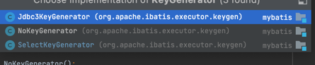
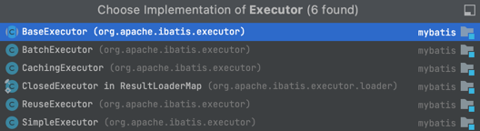

### MyBatis-原理解读
关注公众号《每天学点CRUD》，更多基础知识、面试题答疑学习分享。
### 默认配置文件
mybatis配置文件加载过程
```java
InputStream configStream=Resources.getResourceAsStream("mybatis-config.xml");
SqlSessionFactory sessionFactory = new SqlSessionFactoryBuilder()
        .build(configStream);
```
`Resources.getResourceAsStream`只是获取应用资源，用于封装配置信息。
`SqlSessionFactoryBuilder`是一个构造器，用于根据配置文件信息创建SqlSessionFactory。
看一下`SqlSessionFactoryBuilder#build`方法
```java
  public SqlSessionFactory build(InputStream inputStream, String environment, Properties properties) {
    try {
      XMLConfigBuilder parser = new XMLConfigBuilder(inputStream, environment, properties);
      return build(parser.parse());
    } catch (Exception e) {
      throw ExceptionFactory.wrapException("Error building SqlSession.", e);
    } finally {
      ErrorContext.instance().reset();
      try {
        inputStream.close();
      } catch (IOException e) {
        // Intentionally ignore. Prefer previous error.
      }
    }
  }
```
`XMLConfigBuilder#parse`负责解析xml各个配置项,具体配置项不一一说明，只看关键配置
```java
  private void parseConfiguration(XNode root) {
    try {
      // issue #117 read properties first
      propertiesElement(root.evalNode("properties"));
      Properties settings = settingsAsProperties(root.evalNode("settings"));
      loadCustomVfs(settings);
      loadCustomLogImpl(settings);
      typeAliasesElement(root.evalNode("typeAliases"));
      pluginElement(root.evalNode("plugins"));
      objectFactoryElement(root.evalNode("objectFactory"));
      objectWrapperFactoryElement(root.evalNode("objectWrapperFactory"));
      reflectorFactoryElement(root.evalNode("reflectorFactory"));//代理工厂
      settingsElement(settings);
      // read it after objectFactory and objectWrapperFactory issue #631
      environmentsElement(root.evalNode("environments"));
      databaseIdProviderElement(root.evalNode("databaseIdProvider"));
      typeHandlerElement(root.evalNode("typeHandlers"));// 数据类型转化处理类,
      mapperElement(root.evalNode("mappers"));//解析Mapper
    } catch (Exception e) {
      throw new BuilderException("Error parsing SQL Mapper Configuration. Cause: " + e, e);
    }
  }
```
`mapperElement(root.evalNode("mappers"))` 处理mapper，由于代码深度的原因，直接跟踪代码到
`MapperRegistry#addMapper`->`MapperAnnotationBuilder#parse`->`MapperAnnotationBuilder#parseStatement`，以注解形式mapper为例继续，
`MapperAnnotationBuilder#parseStatement`方法。
这一步`MapperRegistry#addMapper`方法还创建记录了mapper对应代理对象`MapperProxyFactory`，在后续getMapper时使用。
```java
  void parseStatement(Method method) {
    // 入参类型，如果是多个参数返回ParamMap.class
    final Class<?> parameterTypeClass = getParameterType(method);
    final LanguageDriver languageDriver = getLanguageDriver(method);

    getAnnotationWrapper(method, true, statementAnnotationTypes).ifPresent(statementAnnotation -> {
      // 获取sqlSource，用于生成sql
      final SqlSource sqlSource = buildSqlSource(statementAnnotation.getAnnotation(), parameterTypeClass, languageDriver, method);
      final SqlCommandType sqlCommandType = statementAnnotation.getSqlCommandType();
      final Options options = getAnnotationWrapper(method, false, Options.class).map(x -> (Options)x.getAnnotation()).orElse(null);
      final String mappedStatementId = type.getName() + "." + method.getName();
      // 主键id回显的处理
      final KeyGenerator keyGenerator;
      String keyProperty = null;
      String keyColumn = null;
      if (SqlCommandType.INSERT.equals(sqlCommandType) || SqlCommandType.UPDATE.equals(sqlCommandType)) {
        // first check for SelectKey annotation - that overrides everything else
        SelectKey selectKey = getAnnotationWrapper(method, false, SelectKey.class).map(x -> (SelectKey)x.getAnnotation()).orElse(null);
        if (selectKey != null) {
          keyGenerator = handleSelectKeyAnnotation(selectKey, mappedStatementId, getParameterType(method), languageDriver);
          keyProperty = selectKey.keyProperty();
        } else if (options == null) {
          keyGenerator = configuration.isUseGeneratedKeys() ? Jdbc3KeyGenerator.INSTANCE : NoKeyGenerator.INSTANCE;
        } else {
          keyGenerator = options.useGeneratedKeys() ? Jdbc3KeyGenerator.INSTANCE : NoKeyGenerator.INSTANCE;
          keyProperty = options.keyProperty();
          keyColumn = options.keyColumn();
        }
      } else {
        keyGenerator = NoKeyGenerator.INSTANCE;
      }

      Integer fetchSize = null;
      Integer timeout = null;
      StatementType statementType = StatementType.PREPARED;
      ResultSetType resultSetType = configuration.getDefaultResultSetType();
      boolean isSelect = sqlCommandType == SqlCommandType.SELECT;
      boolean flushCache = !isSelect;
      boolean useCache = isSelect;
      if (options != null) {
        if (FlushCachePolicy.TRUE.equals(options.flushCache())) {
          flushCache = true;
        } else if (FlushCachePolicy.FALSE.equals(options.flushCache())) {
          flushCache = false;
        }
        useCache = options.useCache();
        fetchSize = options.fetchSize() > -1 || options.fetchSize() == Integer.MIN_VALUE ? options.fetchSize() : null; //issue #348
        timeout = options.timeout() > -1 ? options.timeout() : null;
        statementType = options.statementType();
        if (options.resultSetType() != ResultSetType.DEFAULT) {
          resultSetType = options.resultSetType();
        }
      }

      String resultMapId = null;
      if (isSelect) {
        ResultMap resultMapAnnotation = method.getAnnotation(ResultMap.class);
        if (resultMapAnnotation != null) {
          resultMapId = String.join(",", resultMapAnnotation.value());
        } else {
          resultMapId = generateResultMapName(method);
        }
      }

      assistant.addMappedStatement(
          mappedStatementId,
          sqlSource,
          statementType,
          sqlCommandType,
          fetchSize,
          timeout,
          // ParameterMapID
          null,
          parameterTypeClass,
          resultMapId,
          getReturnType(method),
          resultSetType,
          flushCache,
          useCache,
          // TODO gcode issue #577
          false,
          keyGenerator,
          keyProperty,
          keyColumn,
          statementAnnotation.getDatabaseId(),
          languageDriver,
          // ResultSets
          options != null ? nullOrEmpty(options.resultSets()) : null);
    });
  }
```
这一步分为1、获取SqlSource，
`buildSqlSource`方法处理sql语句，跟踪到`XMLLanguageDriver#createSqlSource`->`DynamicSqlSource#getBoundSql`
2、获取主键id生成器，KeyGenerator接口的实现
3、ResultMap封装，
4、生成MappedStatement
首先看`MappedStatement`生成，`MappedStatement.Builder`,mybatis获取记录所有mapper方法，
以类和方法名生成id，MS包含了生成sql所有需要的数据。configuration#mappedStatements保存
这里完成第一步配置解析的工作
### OpenSession
```java
  private SqlSession openSessionFromDataSource(ExecutorType execType, TransactionIsolationLevel level, boolean autoCommit) {
    Transaction tx = null;
    try {
      final Environment environment = configuration.getEnvironment();
      final TransactionFactory transactionFactory = getTransactionFactoryFromEnvironment(environment);
      tx = transactionFactory.newTransaction(environment.getDataSource(), level, autoCommit);
      final Executor executor = configuration.newExecutor(tx, execType);
      return new DefaultSqlSession(configuration, executor, autoCommit);
    } catch (Exception e) {
      closeTransaction(tx); // may have fetched a connection so lets call close()
      throw ExceptionFactory.wrapException("Error opening session.  Cause: " + e, e);
    } finally {
      ErrorContext.instance().reset();
    }
  }
```
`openSession`负责创建sql执行时需要的实例
#### Transaction
事务接口，实现有JdbcTransaction、ManagedTransaction
#### Environment
用于管理多个环境数据源
#### Executor
sql执行取器，Mybatis默认提供的实现有，默认用的是SimpleExecutor。
### getMapper
getMapper就是返回第一步解析是创建的代理对象MapperProxyFactory,通过工厂模式创建
`MapperRegistry#getMapper`
```java
  public <T> T getMapper(Class<T> type, SqlSession sqlSession) {
    final MapperProxyFactory<T> mapperProxyFactory = (MapperProxyFactory<T>) knownMappers.get(type);
    if (mapperProxyFactory == null) {
      throw new BindingException("Type " + type + " is not known to the MapperRegistry.");
    }
    try {
      // 创建代理类
      return mapperProxyFactory.newInstance(sqlSession);
    } catch (Exception e) {
      throw new BindingException("Error getting mapper instance. Cause: " + e, e);
    }
  }
```
MapperProxy创建
```java
  protected T newInstance(MapperProxy<T> mapperProxy) {
        return (T) Proxy.newProxyInstance(mapperInterface.getClassLoader(), new Class[] { mapperInterface }, mapperProxy);
  }
  public T newInstance(SqlSession sqlSession) {
    final MapperProxy<T> mapperProxy = new MapperProxy<>(sqlSession, mapperInterface, methodCache);
    return newInstance(mapperProxy);
  }

```

### 执行mapper方法

MapperProxy方法执行
```java
  @Override
  public Object invoke(Object proxy, Method method, Object[] args) throws Throwable {
    try {
      //object对象自身方法 toString等
      if (Object.class.equals(method.getDeclaringClass())) {
        return method.invoke(this, args);
      } else {
        // cachedInvoker复用对象
        return cachedInvoker(method).invoke(proxy, method, args, sqlSession);
      }
    } catch (Throwable t) {
      throw ExceptionUtil.unwrapThrowable(t);
    }
  }
```
```java
  private MapperMethodInvoker cachedInvoker(Method method) throws Throwable {
    try {
      // A workaround for https://bugs.openjdk.java.net/browse/JDK-8161372
      // It should be removed once the fix is backported to Java 8 or
      // MyBatis drops Java 8 support. See gh-1929
      MapperMethodInvoker invoker = methodCache.get(method);
      if (invoker != null) {
        return invoker;
      }

      return methodCache.computeIfAbsent(method, m -> {
        if (m.isDefault()) {
          try {
            if (privateLookupInMethod == null) {
              return new DefaultMethodInvoker(getMethodHandleJava8(method));
            } else {
              return new DefaultMethodInvoker(getMethodHandleJava9(method));
            }
          } catch (IllegalAccessException | InstantiationException | InvocationTargetException
              | NoSuchMethodException e) {
            throw new RuntimeException(e);
          }
        } else {
            // 方法执行
          return new PlainMethodInvoker(new MapperMethod(mapperInterface, method, sqlSession.getConfiguration()));
        }
      });
    } catch (RuntimeException re) {
      Throwable cause = re.getCause();
      throw cause == null ? re : cause;
    }
  }
```
`MapperProxy`执行方法是创建`MapperMethod`
```java
  public MapperMethod(Class<?> mapperInterface, Method method, Configuration config) {
   //对应MappedStatement
    this.command = new SqlCommand(config, mapperInterface, method);
    //MethodSignature 方法执行需要的属性封装
    this.method = new MethodSignature(config, mapperInterface, method);
  }
```
`MethodSignature`的创建设置了多个对象，用于不同的处理。关注`returnType`和`paramNameResolver`
`paramNameResolver`的创建记录方法参数名的映射
```java

  public ParamNameResolver(Configuration config, Method method) {
    this.useActualParamName = config.isUseActualParamName();
    final Class<?>[] paramTypes = method.getParameterTypes();
    final Annotation[][] paramAnnotations = method.getParameterAnnotations();
    final SortedMap<Integer, String> map = new TreeMap<>();
    int paramCount = paramAnnotations.length;
    // get names from @Param annotations
    for (int paramIndex = 0; paramIndex < paramCount; paramIndex++) {
      if (isSpecialParameter(paramTypes[paramIndex])) {
        // skip special parameters
        continue;
      }
      String name = null;
      for (Annotation annotation : paramAnnotations[paramIndex]) {
        if (annotation instanceof Param) {
          hasParamAnnotation = true;
          name = ((Param) annotation).value();
          break;
        }
      }
      if (name == null) {
        // @Param was not specified.
        if (useActualParamName) {
          name = getActualParamName(method, paramIndex);
        }
        if (name == null) {
          // use the parameter index as the name ("0", "1", ...)
          // gcode issue #71
          name = String.valueOf(map.size());
        }
      }
      map.put(paramIndex, name);
    }
    names = Collections.unmodifiableSortedMap(map);
  }

```
Mapper方法的执行过程
`MapperProxy#invoke`->`MethodInvoker#invoke`->`MapperMethod#execute`->`DefaultSqlSession#数据库操作`->`BaseExecutor#数据库操作`
重点看`MapperMethod#execute`
```java
  public Object execute(SqlSession sqlSession, Object[] args) {
    Object result;
    switch (command.getType()) {
      case INSERT: {
        Object param = method.convertArgsToSqlCommandParam(args);
        result = rowCountResult(sqlSession.insert(command.getName(), param));
        break;
      }
      case UPDATE: {
        Object param = method.convertArgsToSqlCommandParam(args);
        result = rowCountResult(sqlSession.update(command.getName(), param));
        break;
      }
      case DELETE: {
        Object param = method.convertArgsToSqlCommandParam(args);
        result = rowCountResult(sqlSession.delete(command.getName(), param));
        break;
      }
      case SELECT:
        if (method.returnsVoid() && method.hasResultHandler()) {
          executeWithResultHandler(sqlSession, args);
          result = null;
        } else if (method.returnsMany()) {
          result = executeForMany(sqlSession, args);
        } else if (method.returnsMap()) {
          result = executeForMap(sqlSession, args);
        } else if (method.returnsCursor()) {
          result = executeForCursor(sqlSession, args);
        } else {
          Object param = method.convertArgsToSqlCommandParam(args);
          result = sqlSession.selectOne(command.getName(), param);
          if (method.returnsOptional()
              && (result == null || !method.getReturnType().equals(result.getClass()))) {
            result = Optional.ofNullable(result);
          }
        }
        break;
      case FLUSH:
        result = sqlSession.flushStatements();
        break;
      default:
        throw new BindingException("Unknown execution method for: " + command.getName());
    }
    if (result == null && method.getReturnType().isPrimitive() && !method.returnsVoid()) {
      throw new BindingException("Mapper method '" + command.getName()
          + " attempted to return null from a method with a primitive return type (" + method.getReturnType() + ").");
    }
    return result;
  }
```
`method.convertArgsToSqlCommandParam(args)`处理入参名称，以insert为例看下执行过程
`DefaultSessionSql#insert`->`DefaultSessionSql#update`->`BaseExecutor#update`->`SimplerExecutor#doUpdate`

*SimplerExecutor#doUpdate*
```java
  @Override
  public int doUpdate(MappedStatement ms, Object parameter) throws SQLException {
    Statement stmt = null;
    try {
      Configuration configuration = ms.getConfiguration();
      StatementHandler handler = configuration.newStatementHandler(this, ms, parameter, RowBounds.DEFAULT, null, null);
     //  这里处理jdbc操作,生成Statement
      stmt = prepareStatement(handler, ms.getStatementLog());
      return handler.update(stmt);
    } finally {
      closeStatement(stmt);
    }
  }
```
获取执行sql
`Configuration.newStatementHandler`->`RoutingStatementHandler#new`->`BaseStatementHandler`->`MappedStatement#getBoundSql`->`DynamicSqlSource#getBoundSql`
```java
  @Override
  public BoundSql getBoundSql(Object parameterObject) {
    // sql解析
    DynamicContext context = new DynamicContext(configuration, parameterObject);
    rootSqlNode.apply(context);
    SqlSourceBuilder sqlSourceParser = new SqlSourceBuilder(configuration);
    Class<?> parameterType = parameterObject == null ? Object.class : parameterObject.getClass();
    SqlSource sqlSource = sqlSourceParser.parse(context.getSql(), parameterType, context.getBindings());
    BoundSql boundSql = sqlSource.getBoundSql(parameterObject);
    context.getBindings().forEach(boundSql::setAdditionalParameter);
    return boundSql;
  }
```
获取statement
`SimplerExecutor#prepareStatement`->`RoutingStatementHandler#prepare`->`BaseStatementHandler#prepare`->`PreparedStatementHandler#parameterize`->`DefaultParameterHandler#setParameters`
设置PrepareStatement
```java
  @Override
  public void setParameters(PreparedStatement ps) {
    ErrorContext.instance().activity("setting parameters").object(mappedStatement.getParameterMap().getId());
    List<ParameterMapping> parameterMappings = boundSql.getParameterMappings();
    if (parameterMappings != null) {
      for (int i = 0; i < parameterMappings.size(); i++) {
        ParameterMapping parameterMapping = parameterMappings.get(i);
        if (parameterMapping.getMode() != ParameterMode.OUT) {
          Object value;
          String propertyName = parameterMapping.getProperty();
          if (boundSql.hasAdditionalParameter(propertyName)) { // issue #448 ask first for additional params
            value = boundSql.getAdditionalParameter(propertyName);
          } else if (parameterObject == null) {
            value = null;
          } else if (typeHandlerRegistry.hasTypeHandler(parameterObject.getClass())) {
            value = parameterObject;
          } else {
            MetaObject metaObject = configuration.newMetaObject(parameterObject);
            value = metaObject.getValue(propertyName);
          }
          TypeHandler typeHandler = parameterMapping.getTypeHandler();
          JdbcType jdbcType = parameterMapping.getJdbcType();
          if (value == null && jdbcType == null) {
            jdbcType = configuration.getJdbcTypeForNull();
          }
          try {
            typeHandler.setParameter(ps, i + 1, value, jdbcType);
          } catch (TypeException | SQLException e) {
            throw new TypeException("Could not set parameters for mapping: " + parameterMapping + ". Cause: " + e, e);
          }
        }
      }
    }
  }
```
之后执行sql`PreparedStatementHandler#update`
```java
  @Override
  public int update(Statement statement) throws SQLException {
    PreparedStatement ps = (PreparedStatement) statement;
    ps.execute();
    int rows = ps.getUpdateCount();
    Object parameterObject = boundSql.getParameterObject();
    // 主键回显
    KeyGenerator keyGenerator = mappedStatement.getKeyGenerator();
    keyGenerator.processAfter(executor, mappedStatement, ps, parameterObject);
    return rows;
  }
```
导致力执行完成返回结果。


